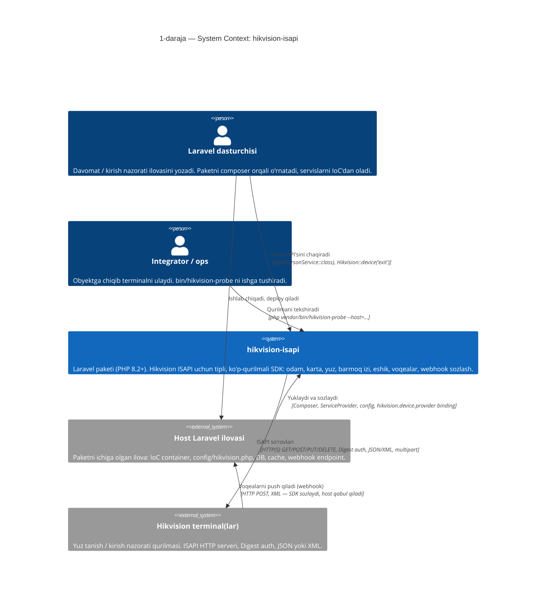
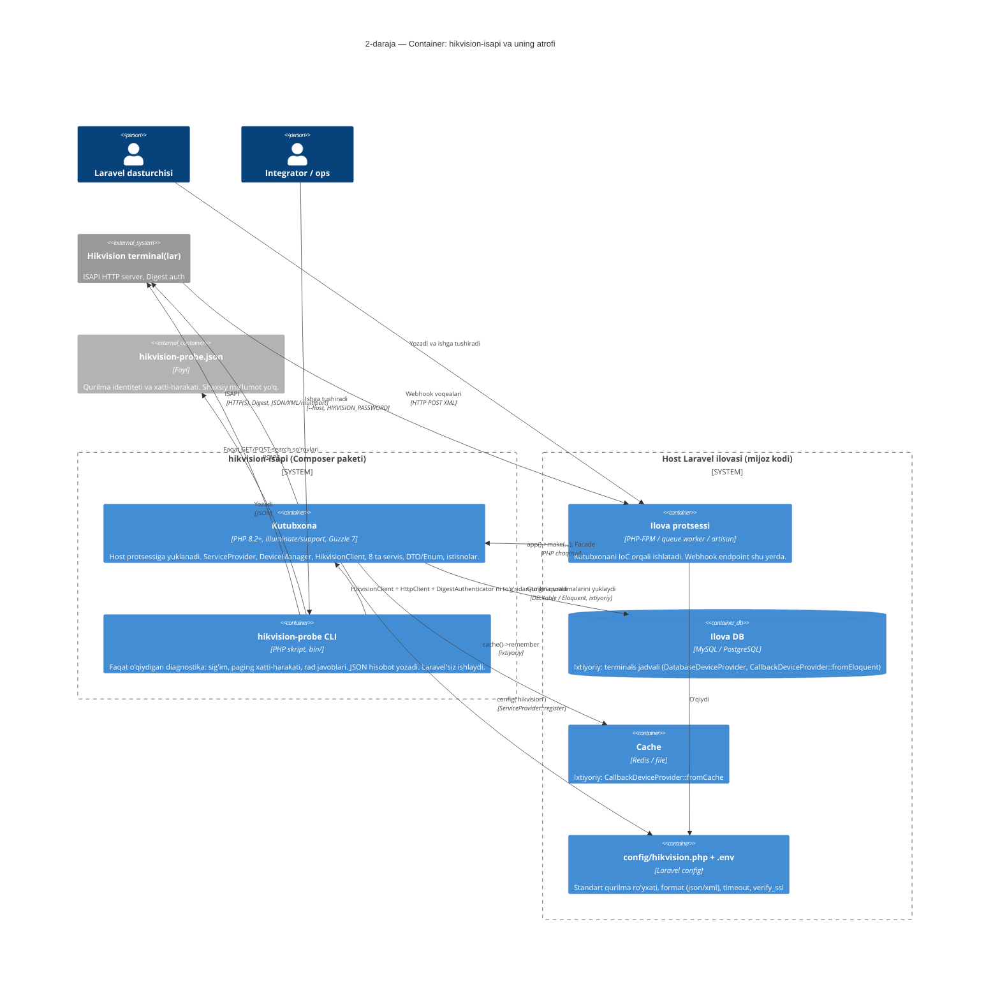
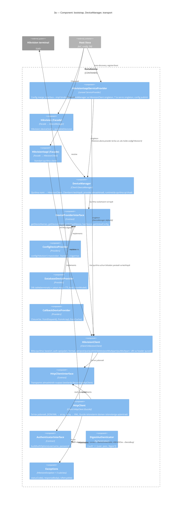
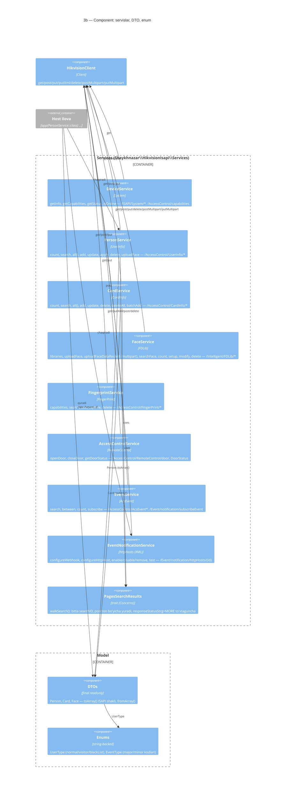
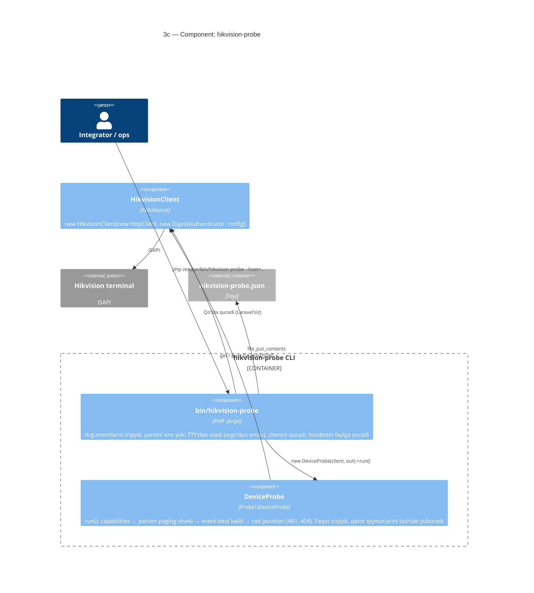
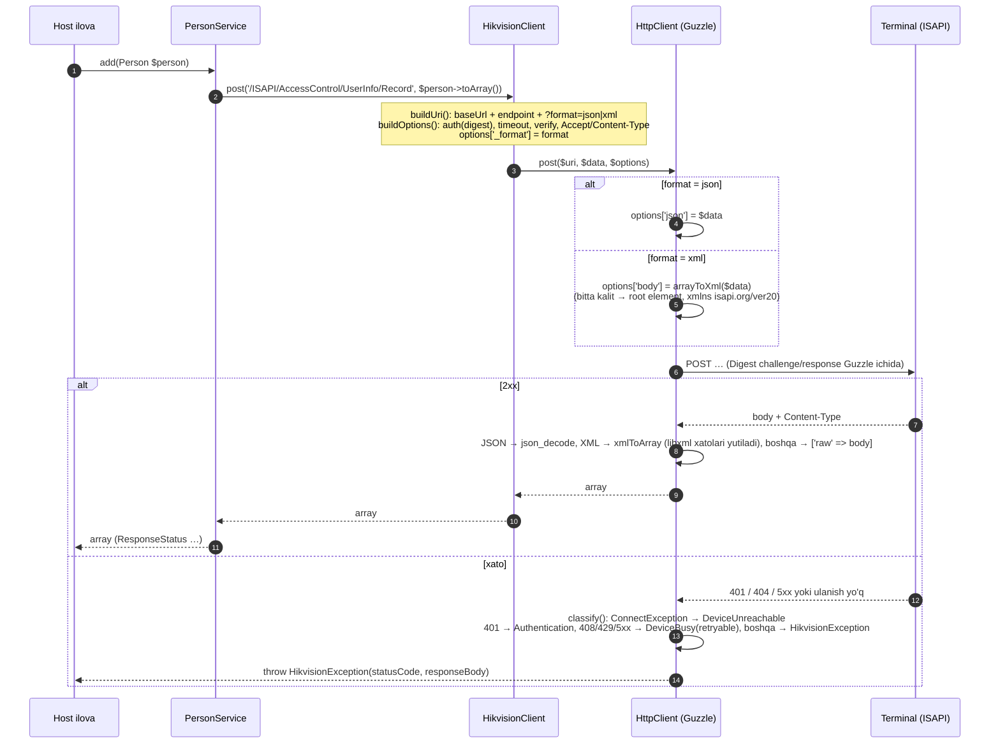
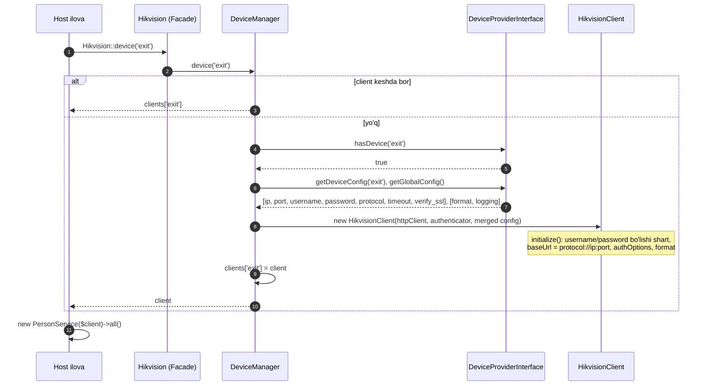
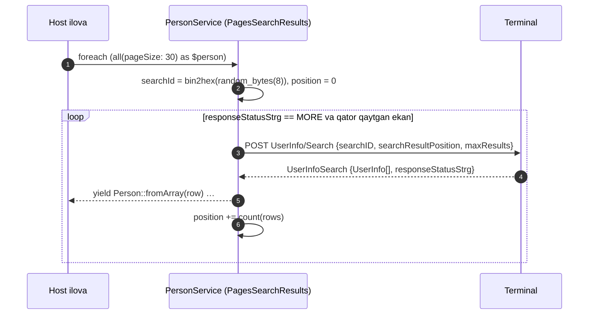
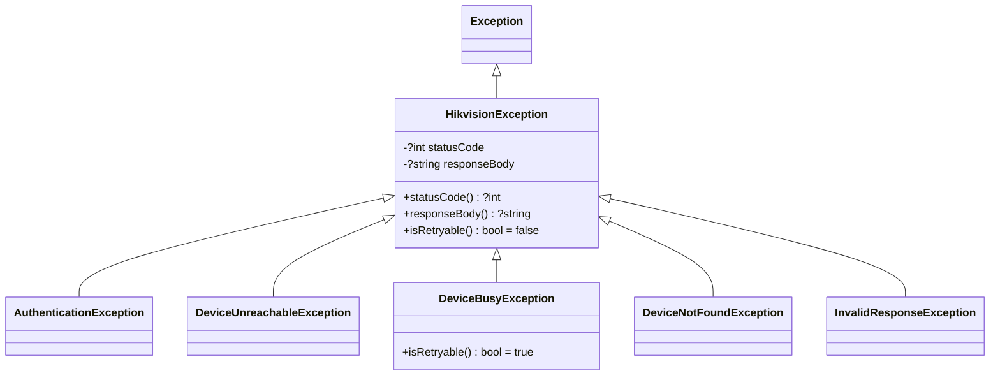
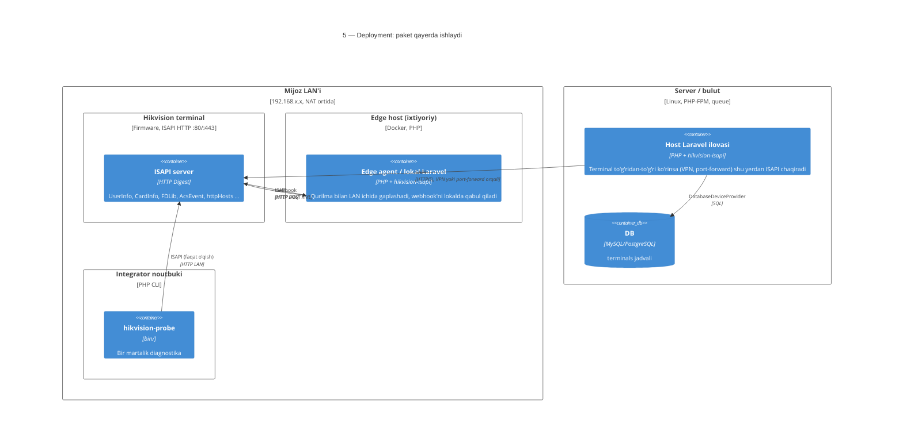

# `hikvision-isapi` — C4 arxitektura modeli

Bu hujjat paketning arxitekturasini [C4 modeli](https://c4model.com) bo'yicha
to'rt darajada tasvirlaydi: **Context → Container → Component → Code**.
Diagrammalar Mermaid'da yozilgan (GitHub va ko'pchilik IDE'lar to'g'ridan-to'g'ri
render qiladi). Xuddi shu model [`workspace.dsl`](workspace.dsl) faylida
Structurizr DSL ko'rinishida ham bor — uni <https://structurizr.com/dsl> ga
qo'yib interaktiv ko'rish mumkin.

Hujjat `src/` dagi haqiqiy koddan yozilgan (v1.5.x, `master`). Rejadagi mahsulot
(edge agent, bulut) uchun [`../startup/02-arxitektura.md`](../startup/02-arxitektura.md)
ga qarang — bu yerda faqat paketning o'zi.

---

## 0. Qamrov: kutubxona uchun C4

`hikvision-isapi` — mustaqil ishlaydigan xizmat emas, **Composer kutubxonasi**.
U doim boshqa Laravel ilovasining protsessi ichida yashaydi. Shuning uchun C4
darajalari quyidagicha talqin qilinadi:

| C4 darajasi | Bu paketda nima |
|---|---|
| **System** | `hikvision-isapi` paketi — host ilova bilan Hikvision terminallari orasidagi adapter |
| **Container** | Ikkita ishga tushadigan birlik: (1) host ilova protsessiga yuklanadigan kutubxona, (2) `bin/hikvision-probe` CLI protsessi |
| **Component** | PHP namespace'lari: `Client`, `Services`, `Authentication`, `Probe`, `DTOs`, `Exceptions`, … |
| **Code** | Sinflar, so'rov oqimi, istisno ierarxiyasi |

---

## 1-daraja. System Context

Paket kimga xizmat qiladi va tashqarida nima bilan gaplashadi.

**Asosiy nuqtalar**

- Paket **faqat chiquvchi** so'rov qiladi: `HikvisionClient → terminal`. U hech
  qanday HTTP endpoint ochmaydi, route yoki controller bermaydi.
- Webhook oqimi ikki qismli: `EventNotificationService` terminalga "voqealarni
  mana bu URL'ga yubor" deb **sozlaydi** (`/ISAPI/Event/notification/httpHosts/{id}`),
  lekin voqeani **qabul qilish** host ilovaning ishi. Paket XML parse qilish uchun
  faqat `HttpClient::xmlToArray` kabi yordamchini beradi, tayyor receiver yo'q.
- Qurilma ro'yxati host ilovadan keladi — config, DB jadvali, Eloquent, cache
  yoki ixtiyoriy callback orqali (`DeviceProviderInterface`).

---

## 2-daraja. Container

Paket ichidagi ishga tushadigan birliklar va ularning host ilova / qurilma bilan
aloqasi.

**Konteynerlar haqida**

| Konteyner | Kirish nuqtasi | Ishga tushish sharti |
|---|---|---|
| Kutubxona | `HikvisionIsapiServiceProvider` (composer `extra.laravel.providers` orqali auto-discovery) | Laravel 12/13 ilovasi |
| `hikvision-probe` | `bin/hikvision-probe` (composer `bin`) | Faqat PHP + Composer autoload. Laravel container **kerak emas** — clientni qo'lda `new` qiladi |

---

## 3-daraja. Component

Kutubxona bir necha qatlamdan iborat. Katta bitta diagramma o'qib bo'lmaydigan
darajada zich bo'lgani uchun uchga bo'lingan: **(3a)** bootstrap va qurilma
tanlash, **(3b)** servis qatlami, **(3c)** probe.

### 3a. Bootstrap, qurilma tanlash va transport

**Mas'uliyatlar qanday bo'lingan**

| Komponent | Biladi | Bilmaydi |
|---|---|---|
| `DeviceManager` | Qurilma nomlari, provider, client keshi | HTTP, ISAPI yo'llari |
| `DeviceProviderInterface` impl'lari | Sozlama qayerdan keladi (config/DB/closure) | Client qanday quriladi |
| `HikvisionClient` | Bitta qurilmaning baseUrl'i, format (`json`/`xml`), auth opsiyalari, `?format=` query, `Accept`/`Content-Type` | Guzzle, XML serializatsiya, istisno turlari |
| `HttpClient` | Guzzle, JSON/XML kodlash, istisno tasnifi | Qurilma, auth usuli, ISAPI semantikasi |
| `DigestAuthenticator` | Guzzle `auth` opsiyasi | Hammasi boshqa |

Bog'liqlik yo'nalishi bir tomonlama: `Services → HikvisionClient → {HttpClientInterface, AuthenticatorInterface}`.
Ikkala interfeys ham ServiceProvider'da bind qilingan, shuning uchun test yoki
boshqa transport (masalan, Laravel `Http` facade) uchun almashtirish mumkin.

### 3b. Servis qatlami (domen operatsiyalari)

Har bir servis `HikvisionClient` ni konstruktor orqali oladi va ISAPI yo'llarini
`private const ENDPOINT_*` sifatida saqlaydi. Servislar bir-biriga bog'liq emas.

**Servis → ISAPI endpoint xaritasi** (koddagi konstantalardan):

| Servis | Endpointlar | Format / metod |
|---|---|---|
| `DeviceService` | `/ISAPI/System/deviceInfo`, `/ISAPI/System/status`, `/ISAPI/AccessControl/capabilities` | GET |
| `PersonService` | `/ISAPI/AccessControl/UserInfo/{Capabilities,Count,Search,Record,Modify,SetUp,Delete}` | GET, POST, PUT |
| `CardService` | `/ISAPI/AccessControl/CardInfo/{capabilities,Count,Search,Record,Modify,Delete}` | GET, POST, PUT |
| `FaceService` | `/ISAPI/Intelligent/FDLib`, `…/capabilities`, `…/{fdid}/picture[/{fpid}]`, `…/FDSearch[/Delete]`, `…/FaceDataRecord`, `…/Count`, `…/FDSetUp`, `…/FDModify` | GET, POST, PUT, DELETE, **multipart** |
| `FingerprintService` | `/ISAPI/AccessControl/FingerPrint/{capabilities,Search,Record,Delete}`, `/ISAPI/AccessControl/CaptureFingerPrint` | GET, POST, PUT |
| `AccessControlService` | `/ISAPI/AccessControl/RemoteControl/door/{n}`, `/ISAPI/AccessControl/DoorStatus/{n}` | PUT, GET |
| `EventService` | `/ISAPI/AccessControl/AcsEvent`, `/ISAPI/AccessControl/AcsEventTotalNum`, `/ISAPI/Event/notification/subscribeEvent` | POST |
| `EventNotificationService` | `/ISAPI/Event/notification/httpHosts[/{id}[/test]]`, `/ISAPI/Event/notification/capabilities` | GET, **PUT XML** (qurilma bu endpoint uchun XML talab qiladi), POST, DELETE |

### 3c. Probe

`DeviceProbe` va CLI ataylab ajratilgan: **so'rash** (`DeviceProbe`) test
qilinadi, **I/O** (parol, fayl) faqat skriptda. Probe `HikvisionException::statusCode()`
va `responseBody()` orqali qurilmaning `subStatusCode` ini hisobotga yozadi —
ya'ni 3a'dagi istisno dizayni shu yerda to'g'ridan-to'g'ri ishlatiladi.

---

## 4-daraja. Code (tanlangan oqimlar)

### 4a. Bitta so'rovning yo'li

`PersonService::add()` misolida — har qanday servis chaqiruvi shu quvurdan o'tadi.

### 4b. Ko'p qurilma: nom → client

`DeviceManager` **singleton**, `HikvisionClient` esa **qurilma boshiga bitta**
(ServiceProvider'dagi `HikvisionClient::class` singleton — bu faqat *standart*
qurilma). Servis singletonlari ham standart qurilmaga bog'langan; boshqa qurilma
uchun servisni qo'lda `new` qilish kerak (README shunday ko'rsatadi).

### 4c. Sahifalab yurish (`all()`)

Nima uchun trait: ISAPI `searchID` ni **qidiruv sessiyasi** deb hisoblaydi;
o'rtada o'zgartirilsa qurilma jimgina boshidan boshlaydi. `PersonService` va
`CardService` bir xil mexanizmni bo'lishadi, `EventService` esa o'zining
`between()` yuruvchisiga ega (u ham `searchID` ni ushlab turadi).

### 4d. Istisno ierarxiyasi

Tasniflash **bitta joyda** — `HttpClient::classify()`. Chaqiruvchi kod uchun
shartnoma: `isRetryable()` true bo'lsa qayta urinish mumkin (408/429/5xx),
`statusCode()`/`responseBody()` orqali qurilmaning `subStatusCode` ini o'qish
mumkin (probe shunday qiladi). `DeviceNotFoundException` va
`InvalidResponseException` hozircha `src/` ichida throw qilinmaydi — tashqi
kod uchun zaxira.

---

## 5. Deployment ko'rinishi

Paket ikki xil joyda deploy bo'ladi. Rejadagi mahsulotda ikkalasi ham bor
(qarang [`../startup/02-arxitektura.md`](../startup/02-arxitektura.md)).

Paketning o'zi bu ikki holatni farqlamaydi — u faqat `ip:port` ga HTTP qiladi.
NAT muammosi (bulutdan terminalni ko'rib bo'lmasligi) paketdan tashqarida,
edge agent bilan hal qilinadi.

---

## 6. Arxitektura qarorlari (koddan o'qilgan)

| # | Qaror | Nima uchun / oqibati |
|---|---|---|
| 1 | Transport (`HttpClientInterface`) va auth (`AuthenticatorInterface`) — kontrakt orqali | Testlar Guzzle'siz ishlaydi (`tests/Support/RecordingHttpClient`); boshqa auth (masalan, session token) qo'shish uchun bitta sinf yetadi |
| 2 | Qurilma manbai — `DeviceProviderInterface` | Config, DB, Eloquent, cache, multi-tenant closure — hammasi `DeviceManager` ga bir xil ko'rinadi. Host ilova `hikvision.device.provider` ni bind qilib almashtiradi |
| 3 | Bitta `HikvisionClient` = bitta qurilma | Client konstruktorda baseUrl/auth'ni hisoblab qo'yadi; `DeviceManager` ularni nom bo'yicha keshlaydi |
| 4 | Format global (`json`/`xml`), lekin endpoint bo'yicha bekor qilinadi (`putXml`) | Ko'p endpointlar JSON'ni qabul qiladi, `httpHosts` faqat XML — servis buni chaqiruvchidan yashiradi |
| 5 | Javob har doim `array` | Servislar Guzzle `Response` ni ko'rmaydi; JSON ham, XML ham bir xil shaklga keladi; noma'lum Content-Type `['raw' => …]` |
| 6 | Istisnolar transport qatlamida tasniflanadi, `isRetryable()` bilan | Chaqiruvchi retry siyosatini HTTP kodlarini bilmasdan yozadi |
| 7 | `#[\SensitiveParameter]` parol, yuz rasmi, so'rov tanasida | Stack trace'da PII/parol ko'rinmaydi (C5 tuzatishi) |
| 8 | Paging — trait, `searchID` sessiyasi bilan | ISAPI'ning "searchID o'zgarsa boshidan boshla" xususiyatiga to'g'ri munosabat |
| 9 | Probe faqat o'qiydi va qator qiymatlarini tashlaydi | Ishlab turgan obyektda xavfsiz; hisobotni PR'ga qo'shish mumkin |
| 10 | Route/controller/migratsiya yo'q | Paket SDK bo'lib qoladi; biznes mantiq (tenant, davomat) alohida repolarda |

## 7. Modelni o'qiganda ko'ringan nomuvofiqliklar

Bular arxitektura hujjatining bir qismi emas, lekin diagrammani kod bilan
solishtirganda chiqdi. Tuzatish alohida ish.

1. **`EventNotificationService` ServiceProvider'da ro'yxatga olinmagan.**
   `registerServices()` 7 ta servisni singleton qiladi, sakkizinchisi yo'q.
   `app(EventNotificationService::class)` Laravel auto-wiring tufayli ishlaydi
   (konstruktor `HikvisionClient` so'raydi, u bind qilingan), lekin har safar
   yangi nusxa bo'ladi. Diagramma 3a'da "7 ta servis" deb yozilgani shundan.
2. **`CallbackDeviceProvider::fromCache()` `getDeviceConfig` uchun `stdClass` qaytaradi**
   (`DB::table(...)->first()`), interfeys esa `?array` va'da qiladi.
   `HikvisionClient::initialize()` `$device['username']` deb o'qiydi — bu
   provider bilan birinchi so'rovdayoq `Cannot use object of type stdClass as array`
   bo'ladi. Jadval nomi ham `terminals` deb qotirilgan.
3. **`DeviceManager::registerDevice()` faqat `ConfigDeviceProvider` bilan ishlaydi**;
   boshqa provider bo'lsa jimgina hech narsa qilmaydi.
4. **`config('hikvision.logging')`** hamma providerda `getGlobalConfig()` orqali
   tashiladi, lekin `src/` da hech qayerda o'qilmaydi — hozircha o'lik sozlama.
5. **`DatabaseDeviceProvider::fromModel()`** `$query` callback'ni qabul qiladi
   va ishlatmaydi; `configColumns` bo'sh massiv berilsa qurilma sozlamasi bo'sh
   chiqadi (konstruktor default'i qo'llanmaydi).

---

## Fayllar

- [`c4-model.md`](c4-model.md) — shu hujjat (Mermaid).
- [`workspace.dsl`](workspace.dsl) — xuddi shu model Structurizr DSL'da:
  Context, Container, Component (kutubxona), Deployment ko'rinishlari.
